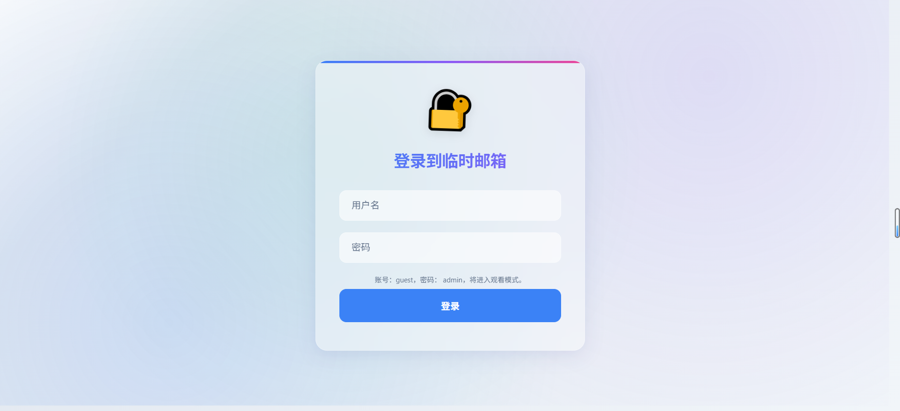
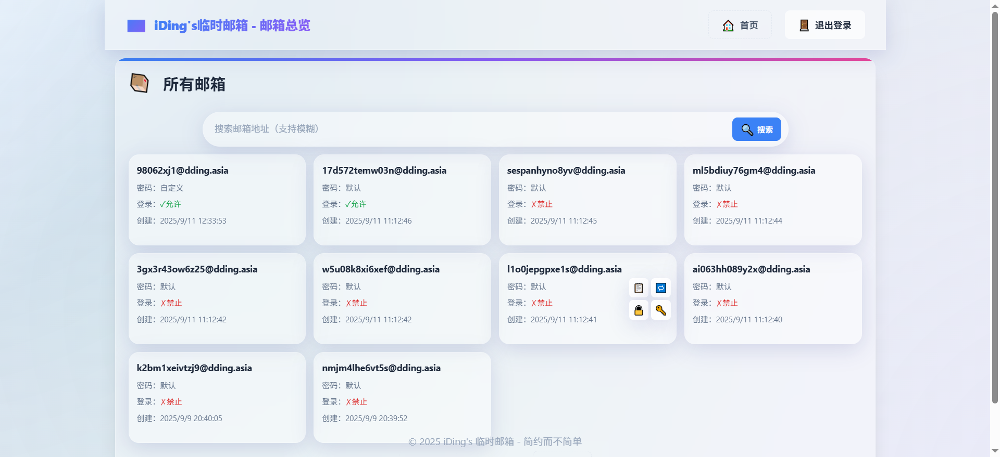
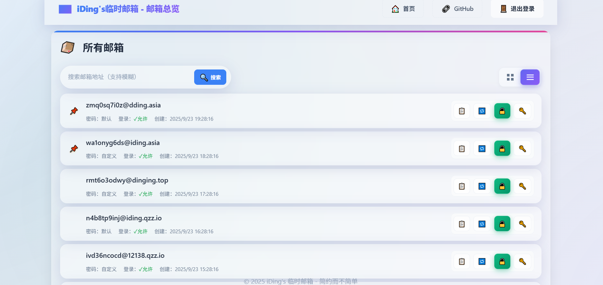

# 临时邮箱 Cloudflare Worker（模块化结构）

当前状态：V4.5 支持多域名发送配置，智能选择API密钥

`
  注：如果需要支持邮箱用户自行修改密码 将mailbox.html中 77行到80行取消注释
`

一个基于 Cloudflare Workers 和 D1 数据库的临时邮箱服务。

## 一键部署

[](https://deploy.workers.cloudflare.com/?url=https://github.com/username/repo)

 ### [点击查看一键部署指南](docs/yijianbushu.md)

## 📸 项目展示
### 体验地址： https://mailexhibit.dinging.top/

### 体验账号： guest
### 体验密码： admin
### 页面展示

#### 登陆

#### 首页


### 手机端生成与历史
<div style="display: flex; gap: 20px; justify-content: center; margin: 20px 0;">
  
  
</div>

### 单个邮箱页


### 全部邮箱预览




#### [更多展示点击查看](docs/zhanshi.md)

## 功能特性

### 🎨 现代化界面
- 🌈 **毛玻璃效果**：采用现代化的毛玻璃（Glassmorphism）设计风格
- 🎯 **简约美观**：浅色背景，动态渐变，视觉效果出色
- 📱 **响应式设计**：完美适配桌面和移动设备
- ✨ **动画效果**：平滑的过渡动画和微交互反馈

### 📧 邮箱管理
- 🎲 **智能生成**：随机生成临时邮箱地址，支持自定义长度和域名
- 📋 **历史记录**：自动保存历史生成的邮箱，方便重复使用
- 🗑️ **便捷删除**：支持删除单个邮箱和批量管理
- 🔄 **一键切换**：快速在不同邮箱间切换

### 🛠️ 用户管理功能

- **角色与权限**: 三层权限模型（严格管理员 Strict Admin / 高级用户 Admin / 普通用户 User），严格管理员拥有全部权限
- **用户列表**: 查看用户名、角色、邮箱上限/已用、是否允许发件、创建时间等关键信息
- **用户邮箱**: 查看指定用户名下的邮箱列表，支持一键复制邮箱地址
- **创建用户**: 通过用户名/密码/角色创建新用户
- **编辑用户**: 支持改名、重置密码、角色切换、发件权限开关、调整邮箱上限
- **分配邮箱**: 批量为用户分配邮箱地址（支持多行粘贴，自动格式校验）
- **删除用户**: 解除用户与邮箱的绑定关系（不会删除邮箱实体与邮件数据）
- **前端权限防护**: 管理页进入前进行快速鉴权，未授权自动跳转，避免内容闪现
- **操作确认与反馈**: 关键操作提供二次确认弹窗与统一 Toast 提示，操作状态与结果清晰可见


### 💌 邮件功能
- 📧 **实时接收**：自动接收和显示邮件，支持HTML和纯文本
- 🔄 **自动刷新**：选中邮箱后每8秒自动检查新邮件
- 🔍 **智能预览**：自动提取和高亮显示验证码内容
- 📖 **详细查看**：优化的邮件详情显示，支持完整内容渲染
- 📋 **一键复制**：智能识别验证码并优先复制，或复制完整邮件内容
- 🗑️ **灵活删除**：支持删除单个邮件或清空整个邮箱
- ✉️ **发件支持（Resend）**：已接入 Resend，可使用临时邮箱地址发送邮件并查看发件记录（发件箱），支持自定义发件显示名（`fromName`）与批量/定时/取消等能力。**V4.5新增**：支持多域名配置，智能选择API密钥。
                                                              详情见《[Resend 密钥获取与配置教程](docs/resend.md)》

## 版本与路线图

### V1
- 前后端基础功能与认证体系
- 邮箱生成、历史记录、邮件列表与详情、清空/删除
- 智能验证码提取与复制、一键复制邮件内容
- 自动刷新与基本的 UI 交互

### V2
- [x] 前端模板解耦：将首页 UI 从 `public/app.js` 内联模板拆分为独立的 `public/templates/app.html`，降低耦合、便于维护
- [x] 发件（Resend）与发件箱：支持通过 Resend 发送邮件、自定义发件显示名（`fromName`）
- [x] 加邮箱置顶功能，提升用户体验
- [X] 路由逻辑优化 防止首页泄露
### V3

#### 登录与权限
- [X] 新增登录系统与三层权限：超级管理员（Strict Admin）/ 高级用户（Admin）/ 普通用户（User）。
- [X] 默认严格管理员用户名来自 `ADMIN_NAME`（默认 `admin`），密码来自 `ADMIN_PASSWORD`。
#### 管理后台（用户管理）
- [X] 入口：登录后右上角"用户管理"（严格管理员和演示模式默认显示）。
- [X] 查看用户列表（用户名、角色、是否可发件、邮箱上限/已用、创建时间）。
- [X] 查看某个用户的邮箱列表。
- [X] 创建用户（用户名/密码/角色）。
- [X] 编辑用户（改名、改密码、切换角色、是否允许发件、调整邮箱上限）。
- [X] 删除用户（不会删除邮箱实体与邮件，仅解除绑定关系）。
- [X] 分配邮箱给指定用户（支持批量，前端做格式校验）。

### V3.5

#### 性能优化
- [X] **极大提升响应速度**：优化数据库查询效率，减少延迟，显著改善用户体验
- [X] **前端资源优化**：减少静态资源加载时间，提升页面渲染速度

#### 存储增强
- [X] **R2 存储原邮件**：新增 Cloudflare R2 对象存储支持，用于保存邮件原始内容
- [X] **混合存储策略**：D1 数据库存储邮件元数据，R2 存储完整邮件内容，优化存储成本

#### 移动端适配
- [X] **手机端完美适配**：全面优化移动设备体验，响应式设计更加流畅
- [X] **移动端专属界面**：针对手机屏幕优化的界面布局和交互方式
- [X] **触控优化**：优化触屏操作体验，支持手势操作

### V4 
- [X] 添加支持邮箱单点登陆
- [X] 添加全局邮箱管理功能，支持限制单个邮箱登陆
- [X] 添加邮箱搜索功能，便捷寻找指定邮箱
- [X] 添加随机人名生成邮箱功能
- [X] 列表和卡片两种展示方式

### V4.5
- [X] **多域名发送配置**：支持为不同域名配置不同的Resend API密钥，实现智能发送
- [X] **配置格式扩展**：支持键值对、JSON、单密钥三种配置格式，兼容旧版配置
- [X] **智能API选择**：系统根据发件人域名自动选择对应的API密钥进行发送
- [X] **批量发送优化**：批量发送时自动按域名分组，并行处理提升发送效率

## API 文档

### 根管理员令牌（Root Admin Override）

- 当请求携带与 `wrangler.toml` 配置项 `JWT_TOKEN` 相同的令牌时，将被视为最高管理员（strictAdmin）。
- 支持三种携带方式（任一即可）：
  - Authorization 头：`Authorization: Bearer <JWT_TOKEN>`
  - 自定义头：`X-Admin-Token: <JWT_TOKEN>`
  - URL 查询参数：`?admin_token=<JWT_TOKEN>`
- 适用范围：所有 `/api/*` 接口、`/api/session`、`/receive` 以及管理页访问判定。

完整接口说明已迁移至独立文档，包含登录认证、邮箱与邮件、发件（Resend）以及“用户管理”相关接口。

- 查看文档：[`docs/api.md`](docs/api.md)

详见《[V3 版本更新日志](docs/v3.md)》。


### 🔧 技术特性
- ⚡ **基于 Cloudflare**：利用全球网络，访问速度快
- 💾 **D1 数据库**：可靠的数据存储，支持数据持久化
- 🔐 **安全认证**：内置登录系统，保护数据安全
- 🎯 **API 完善**：提供完整的 RESTful API 接口

## 部署步骤

[](https://deploy.workers.cloudflare.com/?url=https://github.com/username/repo)

 ### [一键部署指南](docs/yijianbushu.md)

> 提示：如需开启发件功能，还需在 Resend 完成发信域名验证并创建 API Key。
>                                 不会配置？请查看《[Resend 密钥获取与配置教程](docs/resend.md)》。

Cloudflare 连接 GitHub 仓库部署
- 如果使用 Git 集成而非 wrangler deploy，请在 Dashboard → Workers → Settings → Variables 中手动配置上述变量
- `[assets]` 已指向 `public/`，静态页面由 Workers + Assets 提供

### 配置邮件路由（必需用于收取真实邮件）

如果需要接收真实邮件，需要在 Cloudflare 控制台配置邮件路由：

1. 进入域名的 Email Routing 设置
2. 添加 Catch-all 规则
3. 目标设置为 Worker: `temp-mail-worker`

### 设置自定义域名（可选）

在 Worker 设置中添加自定义域名，或使用 workers.dev 子域名。

## 环境变量说明

| 变量名 | 说明 | 必需 |
|--------|------|------|
| TEMP_MAIL_DB | D1 数据库绑定 | 是 |
| MAIL_EML | R2 存储桶绑定，用于保存完整的邮件 EML 文件 | 是 |
| MAIL_DOMAIN | 用于生成临时邮箱的域名，支持多个，使用逗号或空格分隔（如 `iding.asia, example.com`） | 是 |
| ADMIN_PASSWORD | 后台访问密码（严格管理员登录） | 是 |
| ADMIN_NAME | 严格管理员用户名（默认 `admin`） | 否 |
| JWT_TOKEN / JWT_SECRET | JWT 签名密钥（二选一，推荐 `JWT_TOKEN`） | 是 |
| RESEND_API_KEY / RESEND_TOKEN | Resend 发件配置。支持单密钥、多域名键值对、JSON格式 | 否 |
| FORWARD_RULES | 邮件转发（转发到指定邮箱）。支持两种格式：`JSON 数组` 或 `逗号分隔 KV` | 否 |

### RESEND_API_KEY / RESEND_TOKEN 多域名配置说明

支持三种配置格式，满足不同场景需求：

1. **单密钥格式**（向后兼容）
   ```
   RESEND_API_KEY="re_xxxxxxxxxxxxxxxxxxxxxxxx"
   ```

2. **键值对格式**（推荐）
   ```
   RESEND_API_KEY="domain1.com=re_key1,domain2.com=re_key2"
   ```

3. **JSON格式**
   ```
   RESEND_API_KEY='{"domain1.com":"re_key1","domain2.com":"re_key2"}'
   ```

**使用说明：**
- 发送邮件时，系统会根据发件人邮箱域名自动选择对应的API密钥
- 如果发件人域名未配置对应密钥，发送将失败
- 批量发送时会自动按域名分组，并行处理以提升效率
- 单密钥格式兼容旧版配置，可直接升级使用

> 发件相关的域名验证与密钥创建步骤，请参考《[docs/resend.md](docs/resend.md)》；如果你不清楚如何配置，请直接按照教程一步步操作。
### FORWARD_RULES 示例
> 说明：规则按前缀匹配，命中第一个前缀即转发；`*` 为兜底规则。未配置或设置为空/disabled/none 时不进行任何转发。

- 逗号分隔（KV）：
  - `FORWARD_RULES="vip=a@example.com,news=b@example.com,*=fallback@example.com"`
- JSON 数组：
  - `FORWARD_RULES='[{"prefix":"vip","email":"a@example.com"},{"prefix":"*","email":"fallback@example.com"}]'`
- 仅指定某些前缀（无兜底）：
  - `FORWARD_RULES="code=a@example.com,login=b@example.com"`
- 禁用转发：
  - `FORWARD_RULES=""` 或 `FORWARD_RULES="disabled"` 或 `FORWARD_RULES="none"` 或 `FORWARD_RULES="[]"`
  转发的目标地址需要在 Cloudflare 的 Email Addresses 中添加/验证


## 注意事项
- **静态资源缓存**：Workers + Assets 对静态文件可能有缓存。更新 `index.html` 后如未生效，请在 Cloudflare 控制台进行 `Purge Everything`，并在浏览器执行强制刷新（Ctrl/Cmd+F5）。
- **图标路径**：favicon 建议使用相对路径（例如 `favicon.svg`），避免挂在子路径时 404。
- **邮件路由**：若需接收真实邮件，请正确配置 Cloudflare Email Routing（MX 记录、Catch‑all → 绑定到 Worker）。
- **R2 存储**：R2 用于保存完整的邮件 EML 文件，支持邮件下载功能。R2 有免费额度限制，建议定期清理过期邮件。
- **数据库与费用**：D1 有免费额度限制；建议定期清理过期邮件以节省存储空间与额度。
- **安全**：务必在生产环境修改 `ADMIN_PASSWORD`、`JWT_TOKEN`，并限制仓库/项目的敏感信息暴露。

## Resend 教程（发件）

- 教程文档：请见《[Resend 密钥获取与配置教程](docs/resend.md)》。
  - 覆盖域名验证、创建 API Key、在 Cloudflare Workers 设置 `RESEND_API_KEY` Secret 的完整流程
  - 详细列出后端发件相关接口（`/api/send`、`/api/send/batch`、`/api/send/:id`、`/api/send/:id/cancel`、`/api/sent` 等）与示例
  - 前端已集成“发件箱”，在生成/选择邮箱后可直接发信并查看记录；自定义发件显示名通过 `fromName` 字段传入

### 发件相关 API（摘要）
- `POST /api/send` 发送单封邮件（支持 `fromName` 自定义发件显示名）
- `POST /api/send/batch` 批量发送
- `GET /api/send/:id` 查询单封邮件发送状态
- `PATCH /api/send/:id` 更新（如定时 `scheduledAt`）
- `POST /api/send/:id/cancel` 取消发送
- `GET /api/sent?from=xxx@domain` 获取发件记录列表
- `GET /api/sent/:id` 获取发件详情
- `DELETE /api/sent/:id` 删除发件记录

### 多域名发送配置（V4.5新增）

发件API现已支持多域名配置，系统会根据发件人邮箱域名自动选择对应的API密钥：

**配置示例：**
```bash
# 键值对格式
RESEND_API_KEY="dinging.top=re_key1,iding.qzz.io=re_key2"

# JSON格式
RESEND_API_KEY='{"dinging.top":"re_key1","iding.qzz.io":"re_key2"}'
```

**发送示例：**
```javascript
// 发送时系统会自动根据from域名选择密钥
fetch('/api/send', {
  method: 'POST',
  headers: { 'Content-Type': 'application/json' },
  body: JSON.stringify({
    from: 'noreply@dinging.top',  // 使用dinging.top对应的密钥
    to: 'user@example.com',
    subject: 'Test Email',
    html: '<p>Hello World!</p>'
  })
});
```
完整用法与注意事项请参考《[docs/resend.md](docs/resend.md)》。

## 自定义配置

可以通过修改 Worker 代码来自定义：

- 邮箱地址生成规则
- 邮件保存时间
- 界面样式（`public/` 内的 HTML/CSS/JS）
- 功能扩展

## 🛠️ 故障排除

### 常见问题
1. **邮件接收不到**
   - 检查 Cloudflare 邮件路由配置是否正确
   - 确认域名的 MX 记录设置
   - 验证 MAIL_DOMAIN 环境变量配置

2. **数据库连接错误**
   - 确认 D1 数据库绑定名称为 TEMP_MAIL_DB
   - 检查 wrangler.toml 中的数据库 ID 是否正确
   - 运行 `wrangler d1 list` 确认数据库存在

3. **登录问题**
   - 确认 ADMIN_PASSWORD 环境变量已设置
   - 检查 JWT_TOKEN 或 JWT_SECRET 配置
   - 尝试清除浏览器缓存和 Cookie

4. **界面显示异常**
   - 确认静态资源路径配置正确
   - 检查浏览器控制台是否有 JavaScript 错误
   - 验证 CSS 文件加载是否正常

5. **自动刷新不工作**
   - 确认已选中邮箱地址
   - 检查浏览器是否支持 Page Visibility API
   - 查看网络连接是否稳定

### 调试技巧
- 使用 `wrangler dev` 进行本地调试
- 查看 Worker 的实时日志：`wrangler tail`
- 使用浏览器开发者工具检查网络请求
- 检查 D1 数据库中的数据：`wrangler d1 execute TEMP_MAIL_DB --command "SELECT * FROM mailboxes LIMIT 10"`

## Star History

[](https://www.star-history.com/#idinging/freemail&Date)

## 联系方式

- 微信：`iYear1213`

## Buy me a coffee

如果你觉得本项目对你有帮助，欢迎赞赏支持：

<p align="left">
  
  
</p>


## 许可证

Apache-2.0 license
